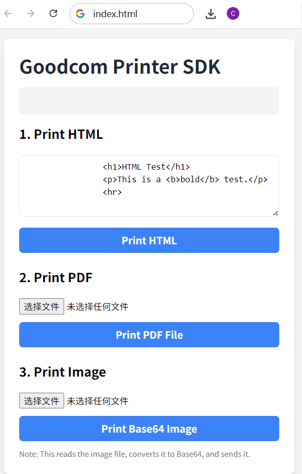
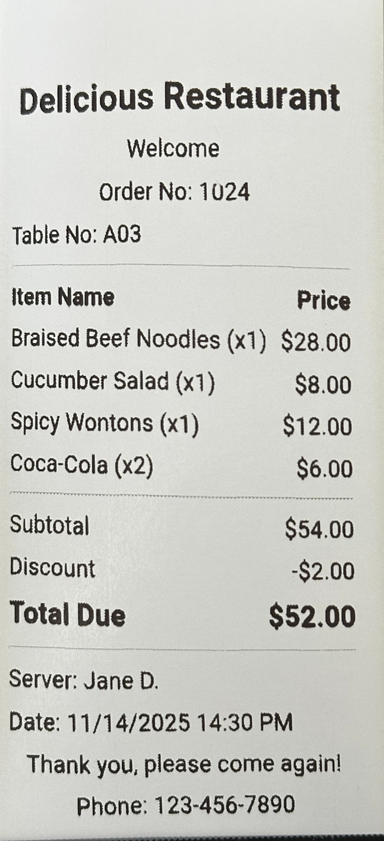

# Example: simple-html-demo

This is a minimal HTML example demonstrating how to include and use the Goodcom Printer SDK via a `<script>` tag.

This demo demonstrates how to directly import the printer SDK without using npm.If you are using npm, you can refer [here](https://github.com/goodcom6/WebPrinterDemo-npm)

<p float="left">
  
  
</p>

## How to Run

1. **Ensure Printer Service is Running**: Make sure the Goodcom printer service is running on your pos.
2. **Open the HTML File**: Open the `index.html` file directly in your web browser (no web server required).
3. **Test Printing**: Click the different buttons on the page, like "Print HTML", to test communication with the printer.

## Key Code Explanation

The core logic is in the `index.html` file:

**1. Include the SDK**

We include the SDK's UMD file from a CDN at the bottom of the `<body>`.

```javascript
<!-- 1. Include the SDK -->
<script src="https://www.igoodcom.com/sdk/goodcom-printer-sdk.umd.cjs"></script>
```

**2. Access the SDK**

After the SDK loads, it attaches itself to `window.GoodcomPrinterSDK`. We use destructuring to get the `GcPrinter` instance class.

```javascript
// Demo Logic
<script>
    document.addEventListener('DOMContentLoaded', () => {
        
        // Get from the global variable
        const { GcPrinter } = window.GoodcomPrinterSDK;

        // Get the status display element
        const statusDiv = document.getElementById('status');
        
        // ...

        // Bind the 'Print Base64 Image' button
        document.getElementById('btn-image').addEventListener('click', () => {
            if (!checkPrinter()) return;
            const fileInput = document.getElementById('image-file');
            const file = fileInput.files[0];
            if (!file) {
                updateStatus('Error: Please select an image file first.', true);
                return;
            }
            updateStatus('Reading file and converting to Base64...');

            const reader = new FileReader();
            reader.onload = async (e) => {
                try {
                    const base64String = e.target.result.split(',')[1];
                    updateStatus('Sending Base64 Image string...');
                    const msg = await GcPrinter.printBase64Image(base64String);
                    updateStatus(`Image Print Success: ${msg}`);
                } catch (e) {
                    updateStatus(`Image Print Error: ${e.message}`, true);
                }
            };
            reader.onerror = () => {
                updateStatus('Error: Failed to read image file.', true);
            };
            reader.readAsDataURL(file); // Read as Data URL
        });

        // ... Logic for other buttons is similar ...
    });
</script>
```